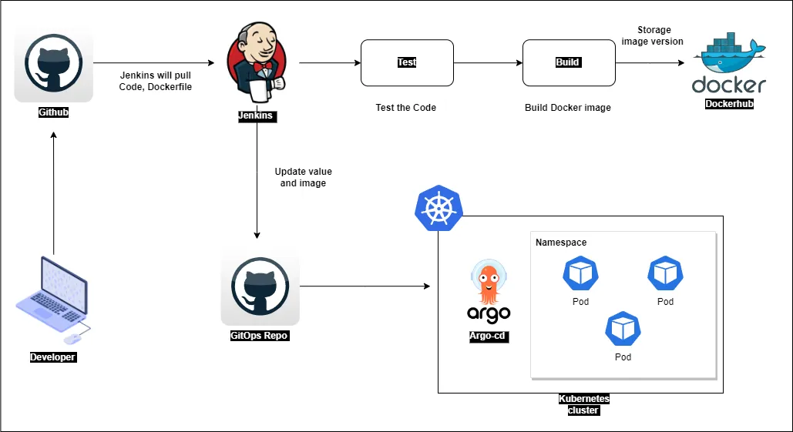

# 🚀 CI/CD Pipeline for Go-REST-API

##  Introduction
This project is an implementation of Continuous Integration and Continuous Deployment (CI/CD) on a simple Go-REST-API application. It provides a comprehensive example of building, testing, and deploying a Go application using GitLab CI and Argo CD.

##  Features
- RESTful API built with Go and Gin
- Demonstrates all CRUD operations
- Includes a simple test suite for unit testing
- Configured CI/CD pipeline for automated building, testing, and deployment
- Static Code Analysis using SonarQube
- GitOps enabled - Utilizes Argo CD for Kubernetes-based deployment
- Dockerized application for easy deployment and scalability

## ⚙️ Prerequisites
Before getting started with this project, ensure you have the following dependencies installed:
- Go (version 1.16+)
- Docker
- Kubernetes Cluster (either local or on Cloud)
- SonarQube server up and running
  - Refer to the documentation to configure SonarQube
- Ngrok (if you wish to run SonarQube in Docker)
- Argo CD installed



##  Overview of CI/CD Workflow

### 🔗 GitLab CI - Continuous Integration
Refer to `.gitlab-ci.yml` for the full configuration.

#### 🔑 Prerequisites
Set up the following environment variables:
- `DOCKERHUB_USER` - DockerHub Username
- `DOCKERHUB_PASS` - DockerHub Password or Access Token
- `SONAR_TOKEN` - SonarQube Token
- `SSH_KNOWN_HOSTS` - SSH known hosts for GitLab (with ssh-keyscan)
- `SSH_PRIVATE_KEY` - SSH private key

#### 🛠️ CI Pipeline Stages
The CI pipeline consists of 5 stages:
1. **build** - Builds the Go binaries for Darwin, Linux, and Windows
2. **test** - Runs unit tests using the Go testing library
3. **code_quality** - Static code analysis using SonarQube
4. **image_build** - Builds a new Docker image and pushes it to DockerHub
5. **update_k8s_manifest** - Updates the latest image tag in Kubernetes manifests

📍 **NOTE:**
- The CI pipeline is configured to trigger "on push" to the project.
- Conditions:
  - Triggers the CI if the commit message ends with `-ci`. Example: `update:readme-ci`
  - Does not trigger the CI if the commit message ends with `-draft` or `-test`

## 🔍 Steps to Run SonarQube
### 🖥️ Run SonarQube Locally (Linux)
```sh
apt install unzip
adduser sonarqube
wget https://binaries.sonarsource.com/Distribution/sonarqube/sonarqube-9.4.0.54424.zip
unzip *
chmod -R 755 /home/sonarqube/sonarqube-9.4.0.54424
chown -R sonarqube:sonarqube /home/sonarqube/sonarqube-9.4.0.54424
cd sonarqube-9.4.0.54424/bin/linux-x86-64/
./sonar.sh start
```
You can access the SonarQube Server on `http://<ip-address>:9000`

### 🐳 Run SonarQube on Docker
```sh
docker run -d --name sonarqube -e SONAR_ES_BOOTSTRAP_CHECKS_DISABLE=true -p 9000:9000 sonarqube:latest
```
Refer to the documentation for more details.

## 🔗 Connecting GitLab and SonarQube Server
If you are using SonarQube in Docker, you may need to expose the Sonar Server using a tool like Ngrok to allow GitLab to communicate with it.

Refer to the guide for more details on using Ngrok and Docker together.

## 📦 Argo CD - Continuous Deployment
Refer to `app.yml` for the full application configuration for Argo CD.

### ⚙️ Configuring Argo CD
Modify the following configurations based on your Kubernetes setup:
```yaml
destination:
    server: https://kubernetes.docker.internal:6443 
    namespace: go-app
```
Argo CD will automatically sync and deploy the application based on the following configuration:
```yaml
syncPolicy:
    automated:
      selfHeal: true
```
Monitor the deployment status and access the application once it's successfully deployed.

📍 **To learn more about Argo CD and configure it in your cluster, refer to the official documentation.**

## 📜 License
This project is licensed under the MIT License. Feel free to use and modify the code according to your needs.

